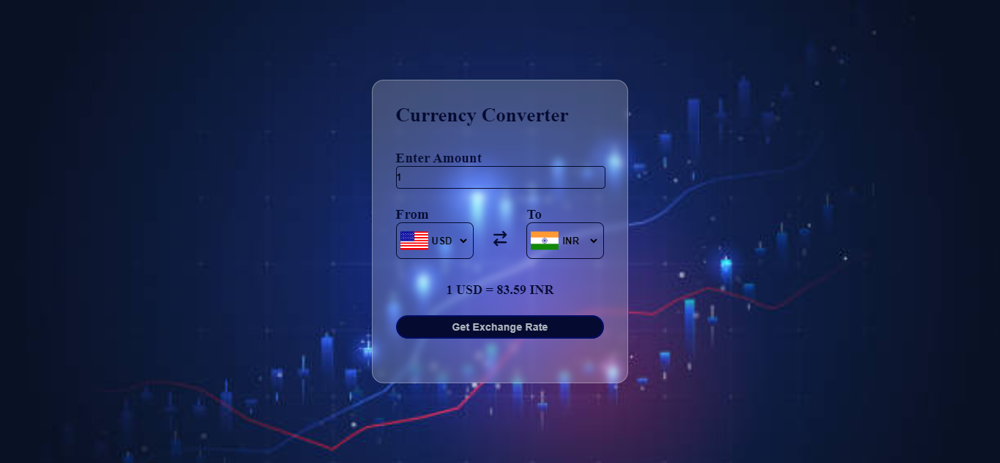

# Currency-Converter...💸
The Currency Converter is a web application that allows users to quickly convert between different currencies, this tool provides a simple and efficient way to get accurate currency conversions.

## Real-Time Exchange Rates
The application fetches real-time exchange rates from an external API, ensuring accuracy and up-to-date information.

## Technologies Used
The project is built using the following technologies:

* HTML: Provides the structure and layout of the web page.
* CSS: Styles the elements for a visually appealing interface.
* JavaScript: Handles the currency conversion logic and API calls.

## Screenshots

## Deployment
Application live at [Currency-Converter](https://kapadiya-gaurav.github.io/Currency-Converter/).
